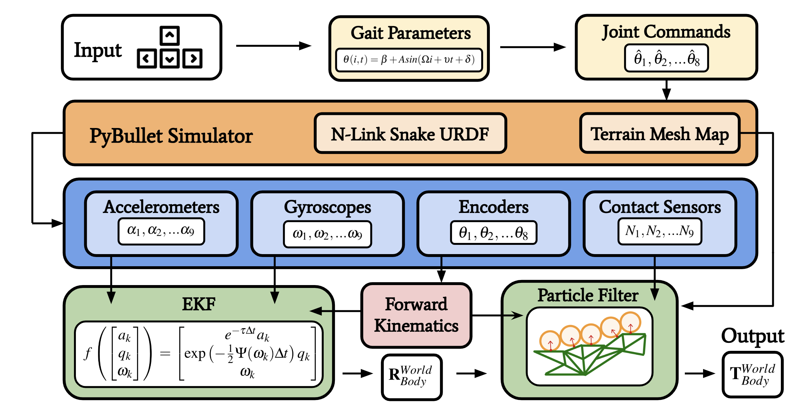

# SnakeSim
## Terrain-Aided Proprioceptive Localization for Snake Robots

Michigan Rob530 Final Project by [Riley Bridges](https://github.com/rbridges12), [Quintin Dwight](https://github.com/qhdwight), [Christian Foreman](https://github.com/ChristianForeman), and [Drew Scheffer](https://github.com/schefferac2020)

<div style="text-align:center;">
    <a href="https://www.example.com">Paper TODO</a>
    |
    <a href="https://www.example.com">Video TODO</a>
    |
    <a href="https://docs.google.com/presentation/d/1imR_9fCTcW1SoMmwVYUvgVVFCQsc4buMuiCciz8RrtQ/edit?usp=sharing">Slides</a>
    
</div>


### Setup 
Install the necessary requirements:
```bash
$ conda create -n SnakeSim python=3.8
$ conda activate SnakeSim
$ pip install -r requirements.txt
```

Run the simulation: 


### Running the Sim 
```bash
$ python3 run_sim.py
```
**Commands**
- **Up/down arrow** - Modulate snake speed command in the forward/backwards direction direction 
- **left/right arrow** - Modulate the turn command
- **spacebar** - reset the gait parameters
- **q** - quit the simulation and show diagnostic plots

### Methodology
<div style="text-align:center;">
    
</div>
